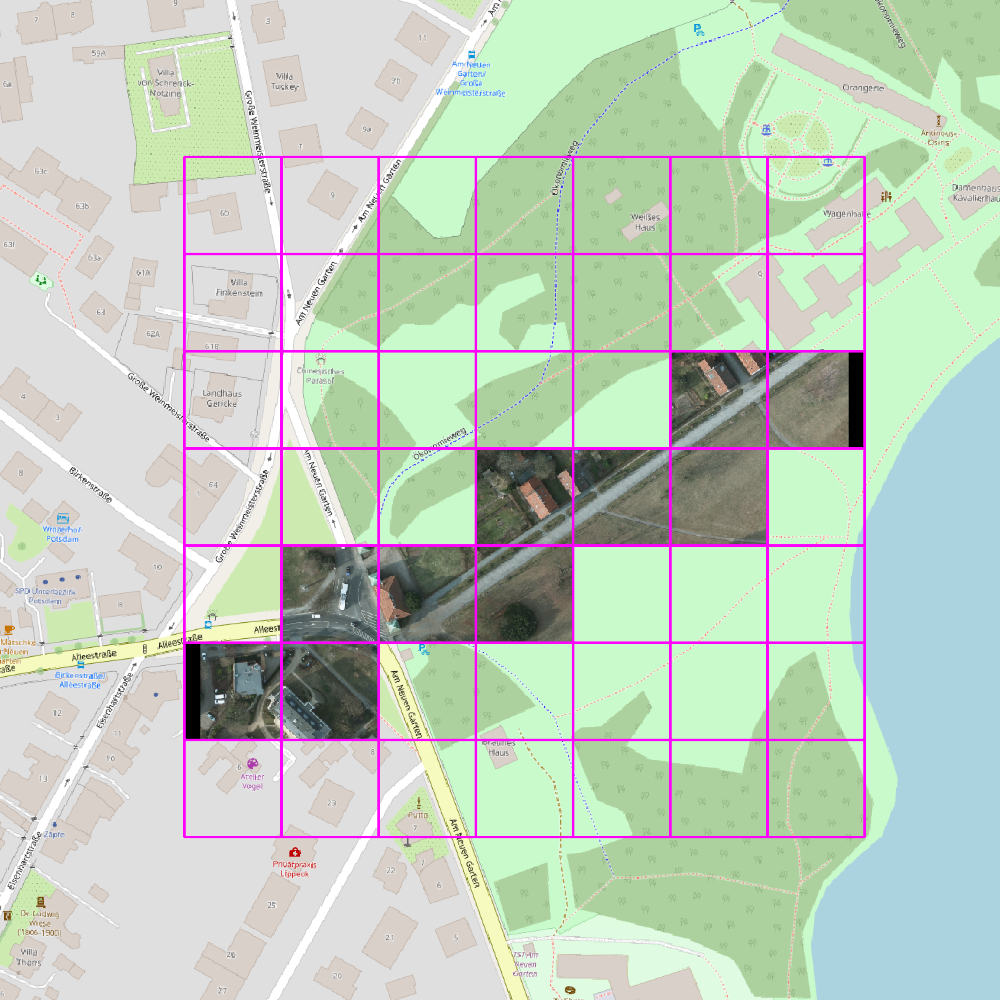
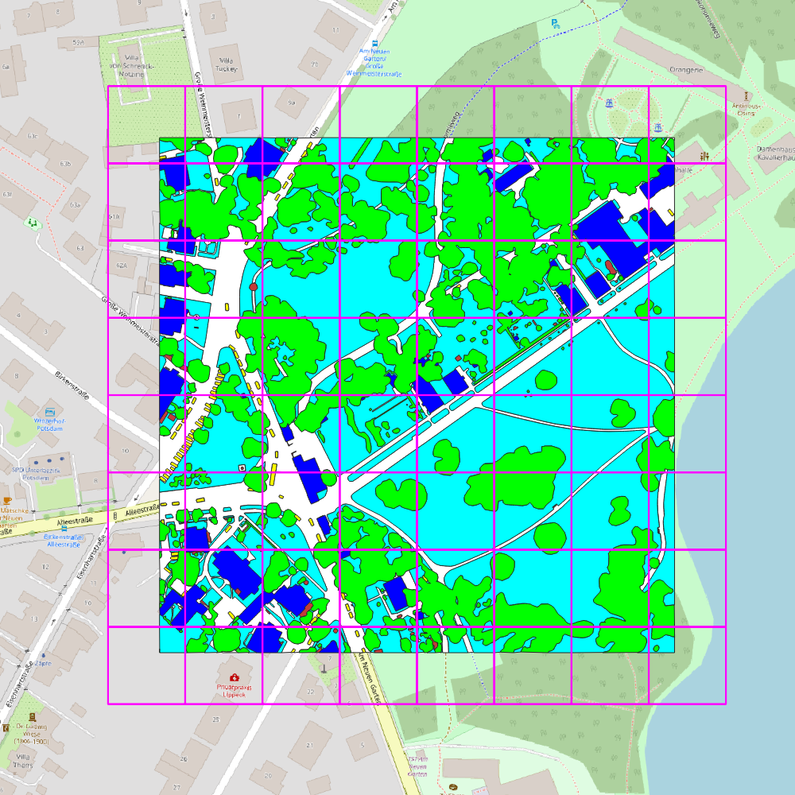
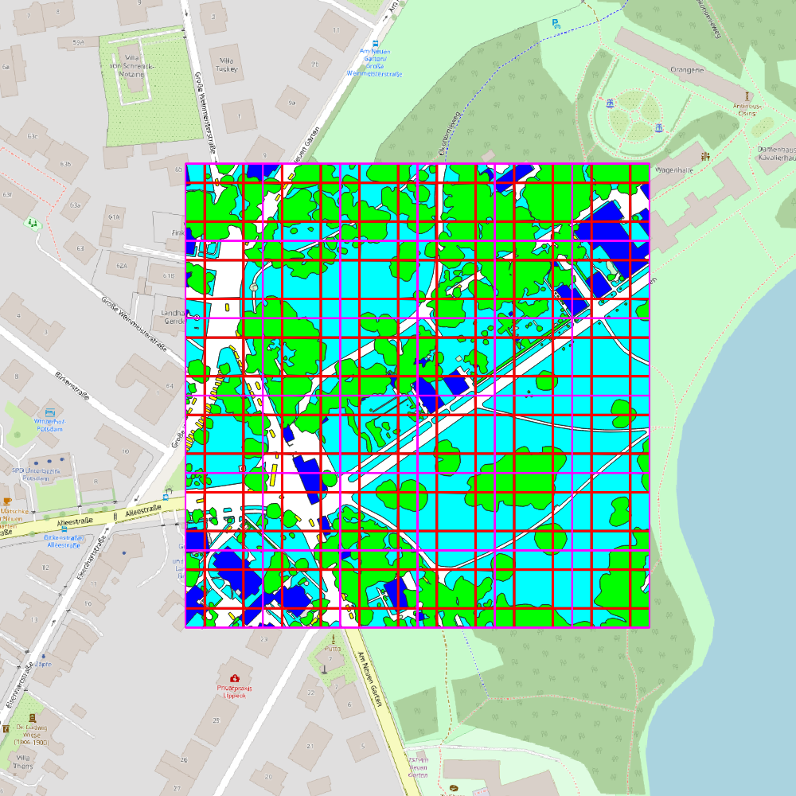
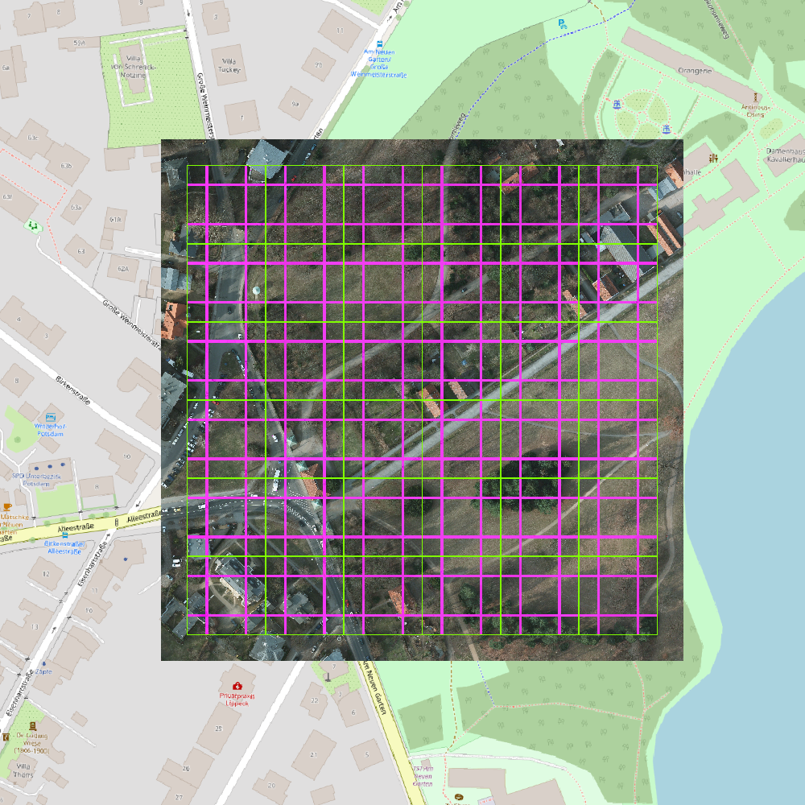
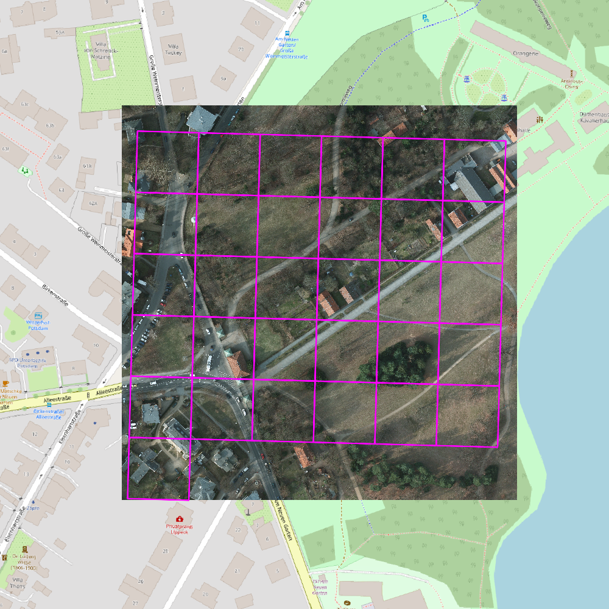
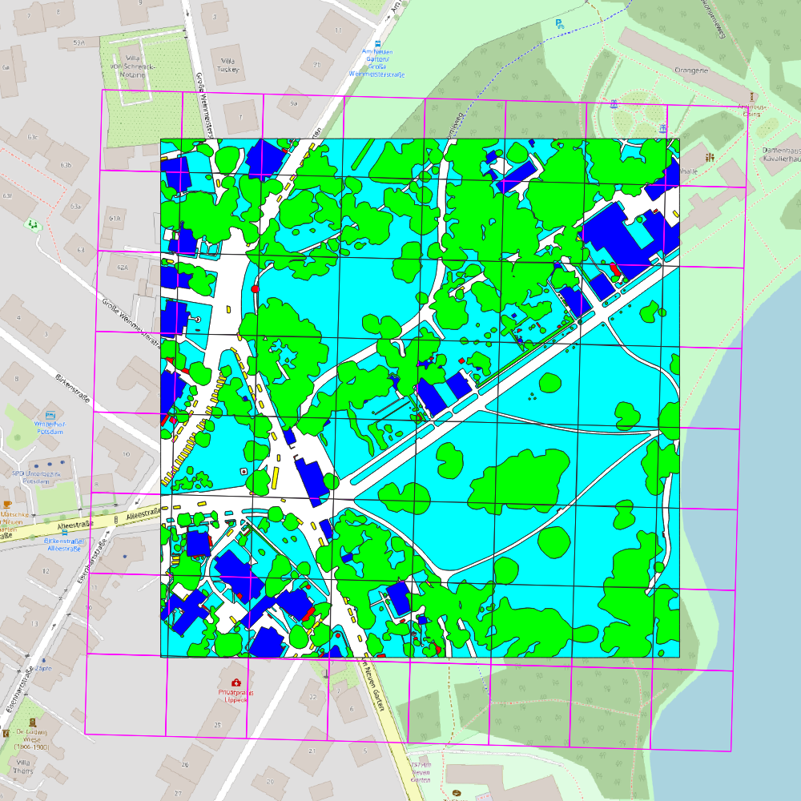

# Examples

## Example Data:
All examples provided under `<examples>` assume that the input data has a
similar structure to
```
├── <example_dataset>
│   ├── raster
│   │   ├── image_1
│   │   │   ├── image_1.tif
│   │   ├── image_1-labels
│   │   │   ├── image_1.tif
│   │   ├── image_2
│   │   │   ├── image_2.tif
│   │   ├── image_2-labels
│   │   │   ├── timage_2.tif
│   │   ├── ...
├── ...
```
The examples use either the
[ISPRS Potsdam](https://www.isprs.org/education/benchmarks/UrbanSemLab/default.aspx) or the
[Open Cities AI](https://mlhub.earth/data/open_cities_ai_challenge) dataset.
The instructions to prepare both datasets are located
[here](doc/examples_potsdam_preparation.md) and
[here](doc/examples_open_cities_ai_preparation.md). The Potsdam dataset has
smaller file sizes and more category labels and is therefore more suitable
for testing. Only the provided rasterization examples require the geojson files
contained in the Open Cities AI dataset.

By running one of the various examples located in `<examples>` the pipeline
will create additional (intermediate) results in this directory, e.g.
```
├── <examples_dataset>
│   ├── raster
│   │   ├── image_1
│   │   │   ├── image_1.tif
│   │   ├── image_1-labels
│   │   │   ├── image_1.tif
│   │   ├── image_2
│   │   │   ├── image_2.tif
│   │   ├── image_2-labels
│   │   │   ├── timage_2.tif
│   ├── image_tiles
│   ├── label_tiles
│   ├── predicted_tiles
│   ├── fused_tiles
│   ├── fused_tiles_aggregated
│   ├── comparison_tiles
│   ├── ...
├── ...
```

## Earth Observation Tile (EOT) examples using the ISPRS Potsdam dataset:

The following examples demonstrate the core capabilities of the EOT library
using the *raster* data of the *ISPRS Potsdam* dataset.

### EOT Color Tiling (`eot_color_tiling_geojson_example.py`)
- Divides all RGB raster images into EOT rgb tiles
- Creates a directory `<examples_dataset>/image_tiles` containing the
   EOT rgb tiles
- Creates for each input raster image a corresponding `grid.json` file
   representing the created tiles as geojson.


### EOT Color Tiling with tile specific geo-data (`eot_color_tiling_aux_xml_example.py`)
  - Divides all RGB raster images into EOT rgb tiles (similar to
     `eot_color_tiling_geojson_example.py`)
  - Creates a directory `<examples_dataset>/image_tiles` containing the
     EOT rgb tiles
  - Creates for each tile an `aux.xml` file with the corresponding
     geo-data. When opening the `jpg` tile in QGIS, QGIS picks up the
     geo-information from the corresponding `aux.xml` file to correctly 
     visualize the tile information



### EOT Label Tiling (`eot_label_tiling_geojson_example.py`)
- Divides all label raster images into EOT label tiles
- Creates a directory `<examples_dataset>/label_tiles` containing the
   label rgb tiles (uses a color palette to represent the classes)
- Creates for each input raster image a corresponding `grid.json` file
   representing the created tiles as geojson.
- Creates for each input raster image and each dataset category a file with
   the aggregated category information (such as `building.json`,
   `car.json`, ...)



### EOT Label Fusion (`eot_label_fusion_example.py`)
  - Performs the full pipeline (tiling, tile fusion, tile aggregation) using
     the label raster images
  - Creates the following directories:
    - `<examples_dataset>/label_tiles`
    - `<examples_dataset>/predicted_tiles`
    - `<examples_dataset>/fused_tiles`
    - `<examples_dataset>/fused_tiles_aggregated`
    - `<examples_dataset>/comparison_tiles`
    - `<examples_dataset>/comparison_tiles_aggregated`
  - The tile prediction step performs a dummy segmentation, i.e. it draws a
     rectangle on each tile denoting the corresponding reliable area (using a
     new index in the color palette)
  - The fused tiles in `<examples_dataset>/fused_tiles` and
     `<examples_dataset>/fused_tiles_aggregated` show the composition of the
     reliable areas of each tile.



### EOT Color Fusion (`eot_color_fusion_example.py`)
  - Performs the full pipeline (similar to `eot_label_fusion_example.py`), but
     uses the RGB raster images to visualize the tiling and the fusion step.
  - Creates the following directories:
    - `<examples_dataset>/image_tiles`
    - `<examples_dataset>/predicted_tiles`
    - `<examples_dataset>/fused_tiles`
    - `<examples_dataset>/fused_tiles_aggregated`
    - `<examples_dataset>/comparison_tiles`
    - `<examples_dataset>/comparison_tiles_aggregated`
  - The tile prediction step performs a dummy segmentation which draws a
     rectangle on each rgb tile denoting the corresponding reliable area.
  - The fused tiles in `<examples_dataset>/fused_tiles` and
     `<examples_dataset>/fused_tiles_aggregated` show the composition of the
     reliable areas of each tile.



## Web Map examples using the ISPRS Potsdam dataset:

In addition to EOT tiles the library also supports web tiles (based on a
mercator projection) as used by services such as OpenStreetMap. The following
examples also use the *raster* data of the *ISPRS Potsdam* dataset. Web map
tiles do not allow to fuse semantic segmentations of adjacent tiles.

### Web Color Tiling (`web_color_tiling_geojson_example.py`)
- Creates a directory `<examples_dataset>/image_tiles` containing the
   web rgb tiles (similar to `eot_color_tiling_geojson_example.py`)
- The web tiles base on a spherical mercator projection of the data
- Creates a single `grid.json` file representing the created tiles as geojson
   (this differs from the EOT approach where a grid is created for each input
   raster image)



### Web Label Aggregation (`web_label_tiling_aggregation_example.py`)
- Creates a directory `<examples_dataset>/label_tiles` containing the
   web label tiles (similar to `eot_color_tiling_geojson_example.py`)
- The web tiles base on a spherical mercator projection of the data
- Creates `<examples_dataset>/tiles_aggregated` containing the aggregated
   results of the web label tiles using geojson files *and* raster images



## Rasterization examples using the Open Cities AI dataset:

The pipeline usually uses raster images to represent the label data, since this
offers several advantages such as a tight coupling of category information and
geo-data matching the properties of the corresponding color images. In order to
convert *vector* labels (e.g. geojson files) to raster labels see
[this example](data_preparation/prepare_open_cities_ai.py).
Converting vector labels to raster images before tiling avoids the repetition
of rasterization step while testing different tiling schemes.
In case you want to work with the *vector* labels directly, see the following
rasterization examples that use the geojson files of the *Open Cities AI*
dataset.

### EOT Rasterization Aggregation (`eot_label_rasterization_aggregation_example.py`)
- Create `<examples_dataset>/label_tiles_rasterized` with EOT label tiles
   derived from a geojson label files (instead of label raster images).
- Creates `<examples_dataset>/rasterized_tiles_aggregated` with the
   corresponding aggregated results

### EOT Tiling Aggregation (`eot_label_tiling_aggregation_example.py`)
- Produces a similar result to `eot_label_rasterization_aggregation_example.py`
   but uses raster labels in the tif images (instead of the vector labels in
   the geojson files)

### Web Rasterization Aggregation (`web_label_rasterization_aggregation_example.py`)
- Create `<examples_dataset>/label_tiles_rasterized` with web label tiles
   derived from a geojson label files (instead of label raster images).
- Creates `<examples_dataset>/rasterized_tiles_aggregated` with the
   corresponding aggregated results
